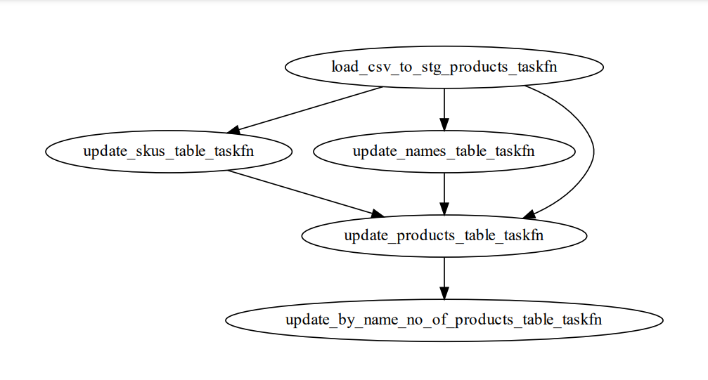
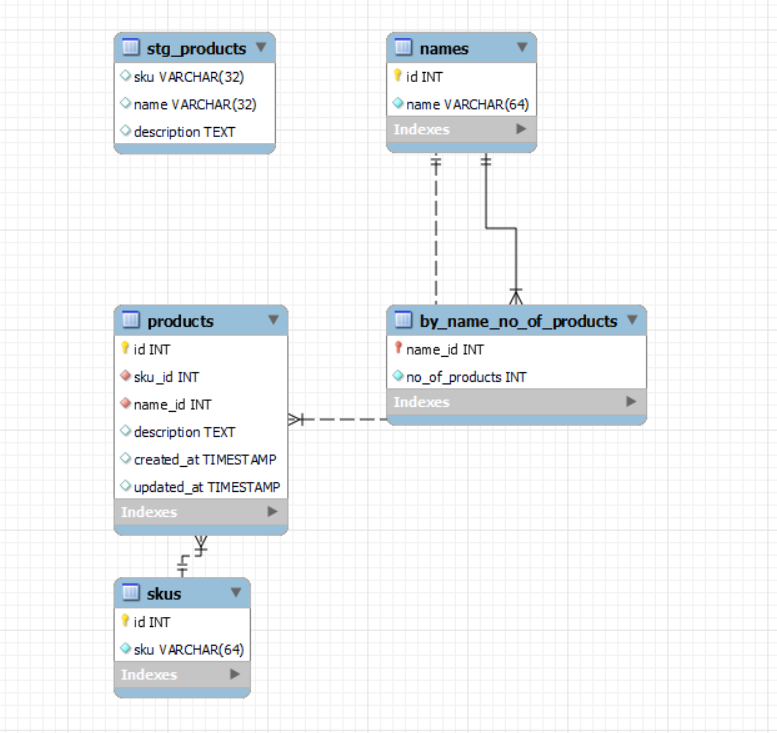

## Postman Data Engineering Round 1 (2022)
The goal of this [problem statement](https://drive.google.com/drive/folders/1X3qomdbjWU1oOTbBvxchTzjLMAwYBWFT) is to store a large csv file into a Relational Database (In my case, I have used [mysql](https://www.mysql.com/products/workbench/)).

## Notes and Quick Start
1. I had manually downloaded the data products.csv.gz file from [here](https://drive.google.com/drive/folders/1X3qomdbjWU1oOTbBvxchTzjLMAwYBWFT) file and saved products.csv from the zip in [data](./data) folder. For your reference I have put [products.csv](./data/products.csv) in data folder.

2. Use [python >= 3.7.6](https://www.python.org/downloads/release/python-376/) and [mysql](https://www.mysql.com/products/workbench/) database

3. Install dependencies
```console
python -m pip install -r requirements.txt
```

4. Update database credentials in [db.toml](./db.toml) file

5. Run the script
```console
python ./run.py
```

6. The database should be populated with the products info (see dabaase schema [here](#database-schema))

## Flow Diagram


## Database Schema
You can table details as code [here](./db/tables.py).

